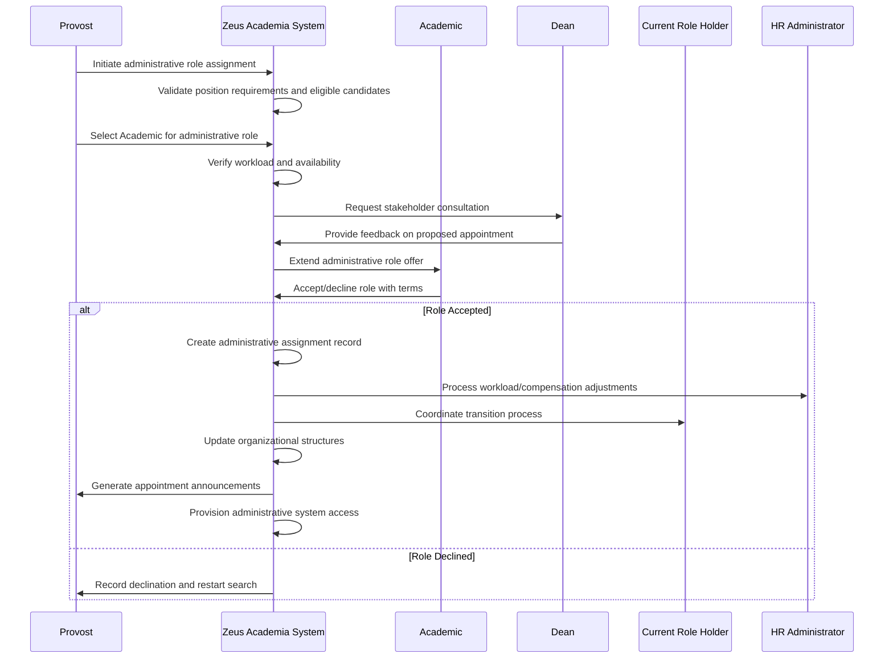

# Use Case: Assign Administrative Role to Academic

- Primary Actor: Provost
- Supporting Actors: Dean, Department Head, HR Administrator, Current Role Holder
- Stakeholders and Interests: Academic (career development), Department (leadership needs), Institution (governance structure), Faculty (representation)

- Goal: Assign an eligible Academic to an administrative role (e.g., Head of Department) with proper validation and transition process
- Scope: Zeus Academia Academic Management System
- Level: User-goal

- Preconditions:
  1. Academic exists with appropriate rank and tenure status for administrative role
  2. Administrative position is available or succession planning is initiated
  3. Academic meets institutional requirements for specific administrative role
  4. Governance policies for administrative appointments are established
  5. Budget allocation exists for administrative compensation and release time

- Triggers:
  - Administrative position becomes vacant requiring immediate appointment
  - Planned succession process initiates search for new administrative leader
  - Academic expresses interest in administrative role and is nominated
  - Institutional reorganization creates new administrative position requirements

## Main Success Scenario
1. Provost initiates administrative role assignment process for specific position.
2. System validates position requirements including rank, tenure, and experience criteria.
3. System identifies eligible Academic candidates meeting all qualification requirements.
4. Provost reviews candidate qualifications and selects Academic for role assignment.
5. System verifies Academic's current workload and availability for administrative duties.
6. Dean and relevant stakeholders are consulted regarding proposed appointment.
7. Academic is approached with role offer including responsibilities and compensation.
8. Academic accepts administrative appointment with agreed-upon terms and timeline.
9. System creates administrative role assignment with effective date and duration.
10. System processes workload adjustments, release time, and administrative compensation.
11. System coordinates transition process with current role holder if applicable.
12. System generates announcements and updates organizational charts and directories.

## Alternate/Exception Flows
A1. Academic does not meet role qualification requirements (Step 2-3):
   1. System identifies specific qualification gaps (rank, tenure, experience).
   2. Provost may seek exception approval or identify alternative candidates.
   3. Academic development plan created if gap can be addressed within timeline.

A2. Academic's current workload prevents administrative role acceptance (Step 5):
   1. System calculates workload impact and required adjustments.
   2. Course release arrangements or additional support may be negotiated.
   3. Phased transition plan developed to manage competing responsibilities.

A3. Stakeholder consultation reveals concerns (Step 6):
   1. System records stakeholder feedback and specific concerns raised.
   2. Provost addresses concerns or seeks alternative appointment options.
   3. Additional consultation or faculty input may be required.

A4. Academic declines administrative role offer (Step 8):
   1. System records declination and maintains Academic's current status.
   2. Provost initiates search for alternative candidate for administrative role.
   3. Succession planning timeline adjusted to accommodate additional search time.

A5. Transition complications with current role holder (Step 11):
   1. System manages overlapping responsibilities and knowledge transfer process.
   2. Extended transition period may be required for complex administrative roles.
   3. Interim arrangements established until smooth transition completed.

## Postconditions
- Success Guarantees:
  - Academic assigned to administrative role with defined responsibilities and authority
  - Workload adjustments implemented including course release and compensation changes
  - Organizational charts and reporting structures updated to reflect new appointment
  - Transition process completed with proper knowledge transfer from predecessor
  - Administrative access and privileges granted for role-specific systems and resources
  - Announcement communications distributed to relevant institutional stakeholders
- Minimal Guarantees:
  - Academic's faculty status and tenure preserved alongside administrative appointment
  - Original teaching and research responsibilities properly redistributed
  - Administrative role governance and accountability structures maintained

## Business Rules
- BR-070: Administrative roles require minimum rank and tenure status as defined by policy
- BR-071: Academic workload adjustment required for significant administrative responsibilities
- BR-072: Administrative compensation supplements base academic salary
- BR-073: Administrative appointments include defined terms and review processes
- BR-074: Course release time allocated based on administrative role scope and responsibility
- BR-075: Transition period required between administrative role holders for knowledge transfer
- BR-076: Administrative role assignment requires appropriate governance approvals

## Non-Functional Notes
- Governance: Administrative appointments follow institutional governance policies
- Performance: Role assignment processing completed within 30 days of selection
- Integration: Administrative access provisioned across all relevant institutional systems
- Succession: Systematic transition planning ensures continuity of administrative functions
- Development: Leadership development opportunities provided for administrative role success
- Accountability: Clear performance expectations and review processes established

