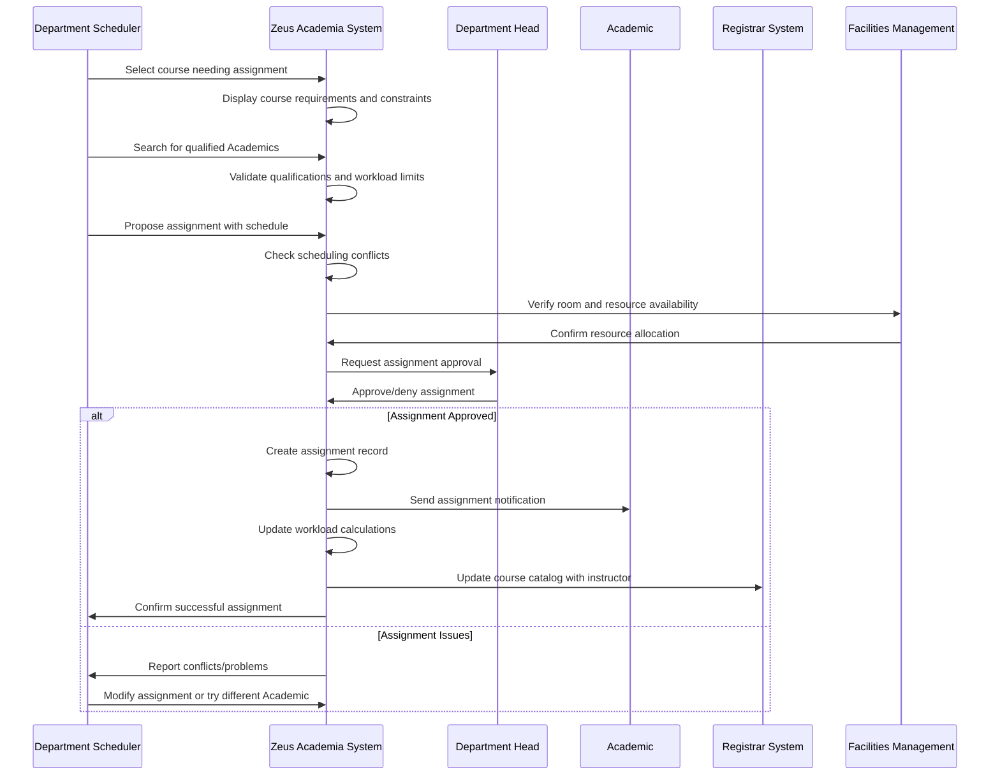

# Use Case: Assign Class to Academic

- Primary Actor: Department Scheduler
- Supporting Actors: Department Head, Registrar, Academic, Course Coordinator
- Stakeholders and Interests: Students (course availability), Academic (workload balance), Department (resource optimization), Institution (academic delivery)

- Goal: Successfully assign a qualified Academic to teach a specific class with proper validation and resource allocation
- Scope: Zeus Academia Academic Management System
- Level: User-goal

- Preconditions:
  1. Academic exists in system with valid employment status and rank
  2. Course exists in course catalog with defined requirements
  3. Academic term/semester is active for registration
  4. Classroom and resource availability can be verified
  5. Academic's current workload is within institutional limits

- Triggers:
  - Department Scheduler begins class assignment process for upcoming term
  - Department Head requests specific Academic for course assignment
  - Academic requests assignment to particular course within their expertise

## Main Success Scenario
1. Department Scheduler selects course requiring Academic assignment for upcoming term.
2. System displays course requirements including subject expertise, rank qualifications, and enrollment projections.
3. Scheduler searches for qualified Academics based on course requirements and availability.
4. System validates Academic's qualifications including degrees, teaching experience, and current workload.
5. Scheduler proposes class assignment including schedule, location, and enrollment capacity.
6. System checks for scheduling conflicts with Academic's existing commitments.
7. Department Head reviews and approves proposed assignment considering departmental needs.
8. System creates class assignment record linking Academic, course, schedule, and resources.
9. Academic receives assignment notification with course materials and preparation timeline.
10. System updates workload calculations and notifies Registrar for catalog publication.
11. System integrates assignment with campus directory, room scheduling, and student systems.

## Alternate/Exception Flows
A1. Academic does not meet course qualification requirements (Step 4):
   1. System displays specific qualification gaps (degree requirements, experience).
   2. Scheduler may seek exception approval or identify alternative qualified Academic.
   3. Department Head may approve assignment with additional support or co-teaching arrangement.

A2. Academic workload exceeds institutional limits (Step 4):
   1. System calculates overload and displays workload limit violation.
   2. Scheduler may adjust other assignments or seek overload approval.
   3. Academic and Department Head must approve any overload assignments.

A3. Scheduling conflicts detected (Step 6):
   1. System identifies specific conflicts with existing assignments or commitments.
   2. Scheduler adjusts proposed schedule or identifies alternative time slots.
   3. Room scheduling system consulted for alternative classroom availability.

A4. Department Head denies assignment (Step 7):
   1. System records denial reason and maintains course as unassigned.
   2. Scheduler must identify alternative Academic or adjust course offering.
   3. Assignment process restarts with different Academic candidate.

A5. Academic declines assignment (Step 9):
   1. System records declination and removes tentative assignment.
   2. Scheduler notified to identify alternative Academic for course.
   3. Workload calculations updated to reflect Academic's actual availability.

A6. Resource conflicts prevent assignment (Step 11):
   1. System identifies classroom, lab, or equipment unavailability.
   2. Facilities management consulted for alternative resource allocation.
   3. Assignment may be modified or deferred pending resource availability.

## Postconditions
- Success Guarantees:
  - Academic assigned to specific course with defined schedule and location
  - Workload calculations updated to reflect new assignment
  - All scheduling conflicts resolved and verified
  - Course listing updated in student registration system
  - Academic notified with necessary course preparation information
  - Resource allocation confirmed including classroom and equipment
- Minimal Guarantees:
  - Course remains available for alternative assignment if current assignment fails
  - Academic's existing workload and commitments remain unchanged
  - System integrity maintained for all scheduling and workload data

## Business Rules
- BR-042: Academic must have appropriate degree qualifications for course subject area
- BR-043: Academic workload cannot exceed institutional maximum without approval
- BR-044: Scheduling conflicts must be resolved before assignment confirmation
- BR-045: Department Head approval required for all class assignments
- BR-046: Room capacity must meet or exceed projected course enrollment
- BR-047: Academic must be notified minimum 30 days before course start date
- BR-048: Course assignments integrate with payroll for compensation calculation

## Non-Functional Notes
- Performance: Assignment process should complete within 15 minutes
- Integration: Real-time updates to registration, payroll, and directory systems
- Usability: Intuitive interface for comparing Academic qualifications and availability
- Scalability: Support concurrent assignment of hundreds of courses per term
- Accuracy: Workload calculations must be precise for compliance and compensation
- Reliability: Assignment data must be preserved and recoverable

