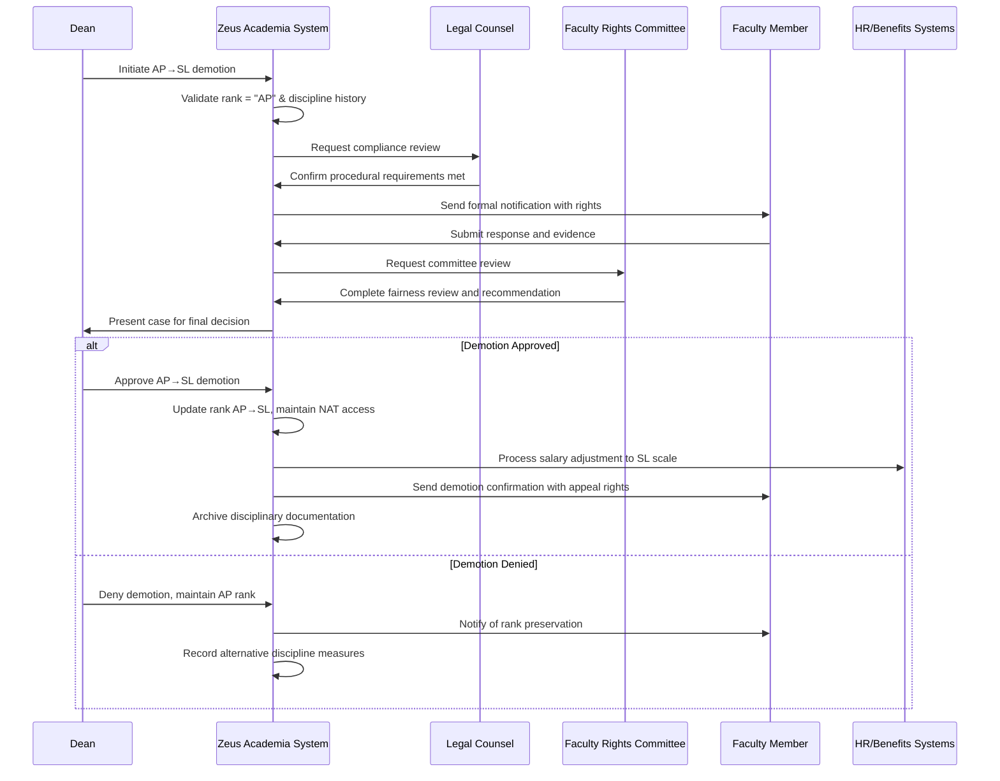

# Use Case: Demote Associate Professor to Senior Lecturer

- Primary Actor: Dean
- Supporting Actors: Department Head, Legal Counsel, Faculty Rights Committee, HR Administrator
- Stakeholders and Interests: Faculty member (career protection), Department (academic standards), Institution (personnel management), Faculty union (due process)

- Goal: Demote an Associate Professor to Senior Lecturer rank following proper disciplinary and legal procedures
- Scope: Zeus Academia Academic Management System
- Level: User-goal

- Preconditions:
  1. Academic exists in system with current rank of Associate Professor (AP)
  2. Performance deficiencies or misconduct have been formally documented
  3. Progressive discipline procedures have been initiated and documented
  4. Department Head has recommended demotion action
  5. Faculty Rights Committee procedural guidelines are established

- Triggers:
  - Dean approves demotion recommendation from Department Head
  - Performance improvement plan failure results in demotion consideration
  - Disciplinary action escalates to require rank reduction

## Main Success Scenario
1. Dean initiates Associate Professor demotion process with documented justification.
2. System validates current rank is "AP" and creates disciplinary case record.
3. System ensures all progressive discipline requirements have been met.
4. Legal Counsel reviews documentation for procedural compliance and legal sufficiency.
5. Faculty member receives formal notification including appeal rights and timeline.
6. Academic provided opportunity to respond with supporting evidence and representation.
7. Faculty Rights Committee reviews case ensuring procedural fairness.
8. Committee issues recommendation considering all evidence and institutional standards.
9. Dean makes final demotion decision based on evidence and committee input.
10. System updates Academic's rank from "AP" to "SL" maintaining National (NAT) access level.
11. System coordinates salary adjustment and employment status changes.
12. System generates compliance notifications and maintains legal documentation.

## Alternate/Exception Flows
A1. Progressive discipline requirements not satisfied (Step 3):
   1. System identifies missing disciplinary steps and timeline gaps.
   2. Dean must complete required progressive discipline before proceeding.
   3. Demotion process suspended until proper procedures followed.

A2. Legal review identifies procedural violations (Step 4):
   1. Legal Counsel documents compliance issues and required corrections.
   2. Dean may correct procedures or seek alternative disciplinary measures.
   3. Use case ends if legal requirements cannot be satisfied.

A3. Faculty member files formal appeal (Step 6):
   1. System manages appeal process according to institutional policies.
   2. Demotion implementation suspended pending appeal resolution.
   3. Independent review board may be convened for final determination.

A4. Faculty Rights Committee finds procedural violations (Step 7):
   1. System records committee findings and recommended corrections.
   2. Dean may address violations or accept committee recommendation against demotion.
   3. Alternative disciplinary measures may be implemented instead.

A5. Union grievance filed challenging demotion (Step 9):
   1. System accommodates collective bargaining agreement grievance procedures.
   2. External arbitration may be required for final resolution.
   3. Demotion held pending arbitrator decision.

## Postconditions
- Success Guarantees:
  - Academic's rank reduced from "AP" to "SL"
  - Access level remains "NAT" (no change required for SL rank)
  - Salary adjusted to Senior Lecturer compensation scale
  - Progressive discipline documentation complete and compliant
  - Faculty Rights Committee review properly documented
  - All appeal and grievance rights preserved and communicated
- Minimal Guarantees:
  - Academic's due process rights fully protected
  - Complete audit trail maintained for legal compliance
  - Employment relationship preserved with modified rank and responsibilities

## Business Rules
- BR-028: Only Associate Professors (AP) may be demoted to Senior Lecturer (SL)
- BR-029: Progressive discipline process must be completed before rank demotion
- BR-030: Faculty Rights Committee review required for AP demotion
- BR-031: Senior Lecturer rank maintains National (NAT) access level
- BR-032: Legal counsel approval required for all rank reduction actions
- BR-033: Appeal rights must be clearly communicated and preserved
- BR-034: Salary adjustment reflects new rank effective immediately

## Non-Functional Notes
- Legal: Full compliance with employment law and faculty rights required
- Performance: Demotion process completed within institutional timeline limits
- Security: Confidential disciplinary records protected throughout process
- Compliance: Faculty handbook and collective bargaining requirements observed
- Documentation: Complete record maintained for potential legal or grievance review
- Fairness: Procedural equity ensured through committee oversight and appeal rights

