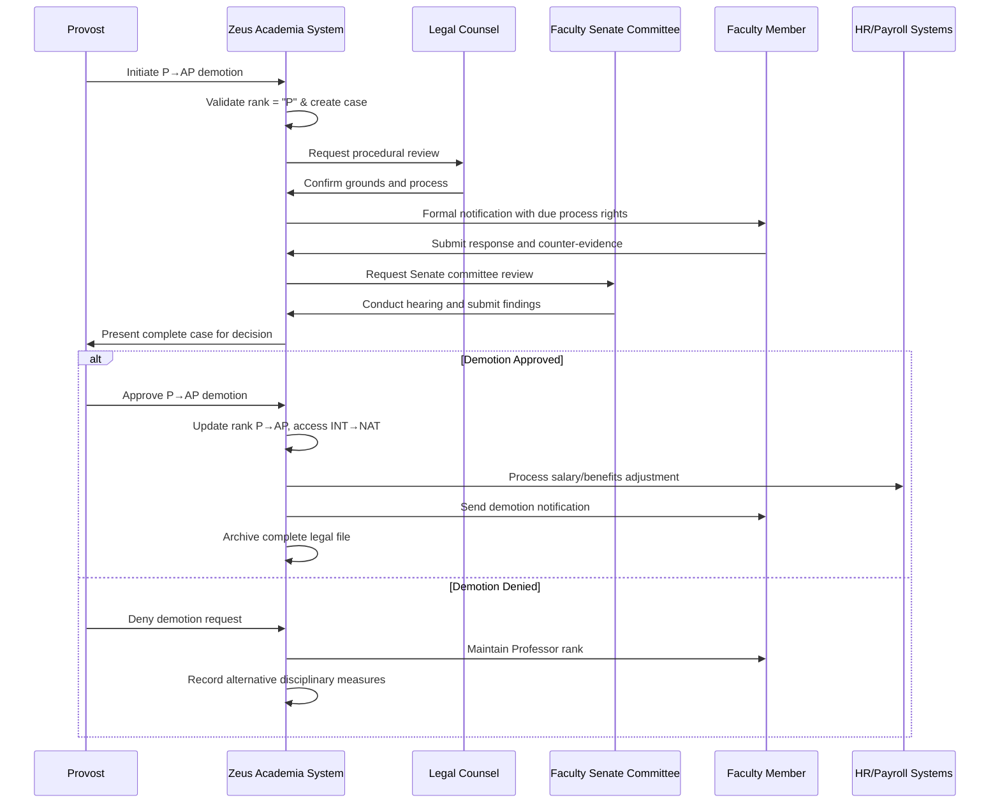

# Use Case: Demote Professor to Associate Professor

- Primary Actor: Provost
- Supporting Actors: Legal Counsel, Faculty Senate, HR Administrator, Union Representative (if applicable)
- Stakeholders and Interests: Faculty member (due process rights), Institution (academic standards), Faculty body (employment security), Legal compliance (procedural fairness)

- Goal: Demote a Professor to Associate Professor rank through proper legal and procedural due process
- Scope: Zeus Academia Academic Management System
- Level: User-goal

- Preconditions:
  1. Academic exists in system with current rank of Professor (P)
  2. Serious performance or conduct issues have been documented
  3. Progressive discipline process has been followed per institutional policy
  4. Legal review has confirmed grounds for demotion exist
  5. Faculty Senate procedural requirements are understood

- Triggers:
  - Provost initiates demotion proceedings after documented performance failures
  - Disciplinary committee recommends rank reduction following investigation
  - Legal settlement agreement includes rank demotion terms

## Main Success Scenario
1. Provost initiates Professor demotion proceedings with documented justification.
2. System validates current rank is "P" and creates formal demotion case file.
3. System triggers due process workflow ensuring all procedural requirements met.
4. Legal Counsel reviews case documentation and procedural compliance.
5. Faculty member is formally notified with complete due process rights information.
6. Academic is provided opportunity to respond and present counter-evidence.
7. Faculty Senate review committee conducts impartial hearing process.
8. Committee issues findings and recommendations to Provost.
9. Provost makes final decision considering all evidence and recommendations.
10. System updates Academic's rank from "P" to "AP" and access level from "INT" to "NAT".
11. System processes salary adjustment and benefits modifications.
12. System generates required notifications and legal compliance documentation.

## Alternate/Exception Flows
A1. Insufficient documentation for demotion grounds (Step 4):
   1. Legal Counsel identifies procedural or evidentiary deficiencies.
   2. Provost may strengthen case documentation or abandon proceedings.
   3. Use case ends with Academic maintaining Professor rank.

A2. Faculty member challenges process through grievance (Step 6):
   1. System tracks formal grievance and associated timeline requirements.
   2. Demotion process suspended pending grievance resolution.
   3. Independent arbitration may be required per collective bargaining agreement.

A3. Faculty Senate committee finds insufficient grounds (Step 8):
   1. System records committee findings and recommendations against demotion.
   2. Provost may accept recommendation or provide additional justification.
   3. Academic may maintain Professor rank with alternative disciplinary measures.

A4. Union intervention requires modified process (Step 7):
   1. System accommodates collective bargaining agreement requirements.
   2. Additional procedural steps or arbitration may be required.
   3. Timeline extends to meet contractual obligations.

A5. Legal action prevents rank change (Step 10):
   1. System maintains Professor rank pending legal resolution.
   2. Demotion held in escrow status until court proceedings complete.
   3. Final rank adjustment depends on legal outcome.

## Postconditions
- Success Guarantees:
  - Academic's rank reduced from "P" to "AP" 
  - Access level downgraded from "INT" to "NAT"
  - Salary adjusted to Associate Professor scale
  - Complete legal compliance documentation maintained
  - All procedural due process requirements satisfied
  - Faculty Senate and union notification requirements met
- Minimal Guarantees:
  - Complete audit trail of demotion process preserved
  - Academic's employment rights protected throughout process
  - Institutional liability minimized through proper procedures

## Business Rules
- BR-021: Only Professors (P) may be demoted to Associate Professor (AP)
- BR-022: Demotion requires documented performance or conduct failures
- BR-023: Complete due process must be followed per institutional policy
- BR-024: Faculty Senate review required for all rank demotions
- BR-025: Legal counsel approval required before demotion implementation
- BR-026: Union notification required if collective bargaining agreement exists
- BR-027: Salary adjustment effective immediately upon rank change

## Non-Functional Notes
- Legal: Complete compliance with employment law and institutional policies required
- Security: Confidential personnel information protected throughout process
- Performance: Due process timeline managed within institutional policy limits
- Compliance: Faculty Senate and union agreement requirements strictly observed
- Audit: Complete documentation for potential legal review maintained
- Risk: Institutional liability minimized through proper procedural adherence

