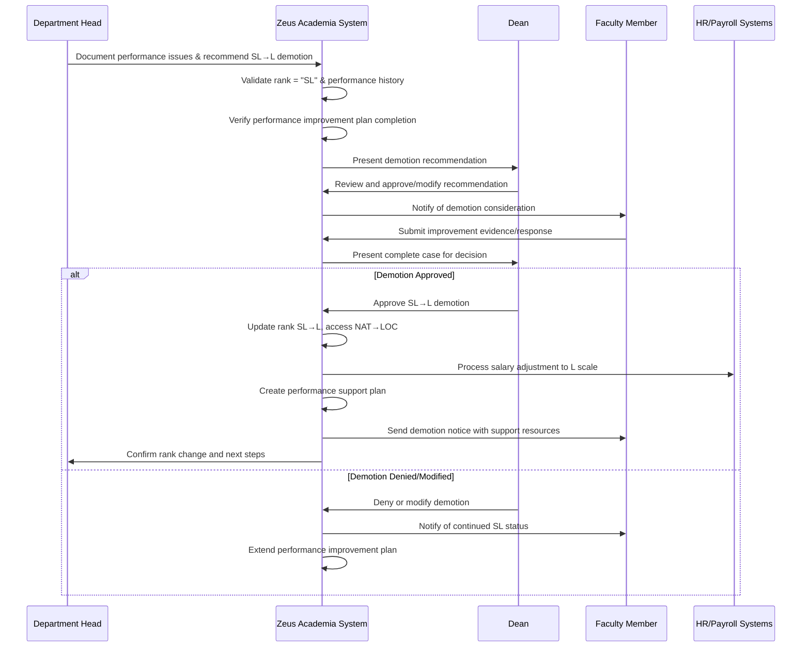

# Use Case: Demote Senior Lecturer to Lecturer

- Primary Actor: Department Head
- Supporting Actors: Dean, HR Administrator, Faculty Representative, Academic Supervisor
- Stakeholders and Interests: Faculty member (job security), Students (instruction quality), Department (academic standards), Institution (performance accountability)

- Goal: Demote a Senior Lecturer to Lecturer rank following proper performance management and disciplinary procedures
- Scope: Zeus Academia Academic Management System
- Level: User-goal

- Preconditions:
  1. Academic exists in system with current rank of Senior Lecturer (SL)
  2. Performance issues have been documented through proper channels
  3. Performance improvement plan has been attempted and failed
  4. Department Head has authority to recommend demotion to Dean
  5. Faculty handbook procedures for rank reduction are available

- Triggers:
  - Performance improvement plan deadline expires without satisfactory progress
  - Serious performance deficiencies require immediate rank adjustment
  - Department Head recommends demotion following documented performance issues

## Main Success Scenario
1. Department Head documents Senior Lecturer performance deficiencies and recommends demotion.
2. System validates current rank is "SL" and reviews performance documentation history.
3. System ensures performance improvement procedures have been properly followed.
4. Dean reviews performance documentation and demotion recommendation.
5. Faculty member receives formal notification of demotion consideration with timeline.
6. Academic provided opportunity to present improvement evidence or mitigation factors.
7. Dean conducts final review considering all performance evidence and responses.
8. System updates Academic's rank from "SL" to "L" and access level from "NAT" to "LOC".
9. System processes salary adjustment to Lecturer compensation level.
10. System generates performance support plan for continued employment success.
11. System notifies relevant departments and updates all integrated systems.

## Alternate/Exception Flows
A1. Performance improvement plan not properly documented (Step 3):
   1. System identifies missing performance management steps.
   2. Department Head must complete required performance procedures.
   3. Demotion process suspended until proper documentation exists.

A2. Dean requires additional performance evidence (Step 4):
   1. System tracks additional documentation requests and timeline.
   2. Department Head provides supplementary performance evidence.
   3. Review process continues with enhanced documentation.

A3. Academic demonstrates significant improvement during review (Step 6):
   1. System records improvement evidence and timeline.
   2. Dean may suspend demotion and extend performance improvement period.
   3. Continued monitoring replaces immediate rank reduction.

A4. Faculty representative identifies procedural violations (Step 6):
   1. System documents procedural concerns raised during review.
   2. Dean addresses violations or postpones demotion pending correction.
   3. Process may restart with proper procedures if violations are significant.

A5. Academic requests transfer instead of demotion (Step 6):
   1. System evaluates transfer options and department availability.
   2. Alternative placement may be considered if suitable positions exist.
   3. Transfer with rank preservation may replace demotion action.

## Postconditions
- Success Guarantees:
  - Academic's rank reduced from "SL" to "L"
  - Access level downgraded from "NAT" to "LOC"
  - Salary adjusted to Lecturer compensation scale
  - Performance support plan established for future success
  - Complete performance documentation maintained in personnel file
  - All university systems updated to reflect Lecturer status
- Minimal Guarantees:
  - Employment relationship maintained with appropriate support
  - Performance improvement opportunities clearly defined
  - Appeal and grievance rights preserved and communicated

## Business Rules
- BR-035: Only Senior Lecturers (SL) may be demoted to Lecturer (L)
- BR-036: Performance improvement plan must precede rank demotion
- BR-037: Lecturer rank automatically assigns Local (LOC) access level
- BR-038: Dean approval required for all Senior Lecturer demotions
- BR-039: Performance support plan required following demotion
- BR-040: Salary adjustment reflects new rank immediately upon change
- BR-041: Demotion does not affect tenure status if applicable

## Non-Functional Notes
- Performance: Demotion process completed within 60 days of recommendation
- Support: Performance improvement resources provided following rank change
- Compliance: Faculty handbook and employment policy requirements observed
- Documentation: Complete performance record maintained for future reference
- Fairness: Consistent application of performance standards across department
- Development: Career development opportunities preserved despite rank reduction

