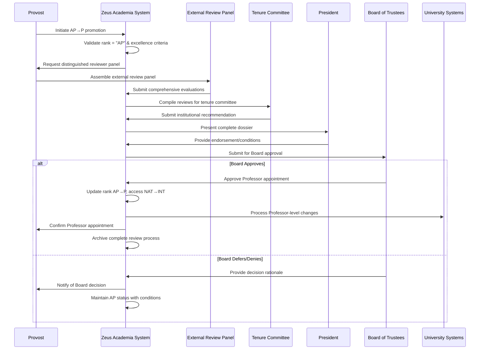

# Use Case: Promote Associate Professor to Professor

- Primary Actor: Provost
- Supporting Actors: Tenure Committee, External Review Panel, Board of Trustees, President
- Stakeholders and Interests: Faculty member (career pinnacle), Institution (academic prestige), Academic discipline (scholarly excellence), Students (research supervision quality)

- Goal: Successfully promote a distinguished Associate Professor to full Professor rank through comprehensive excellence review
- Scope: Zeus Academia Academic Management System  
- Level: User-goal

- Preconditions:
  1. Academic exists in system with current rank of Associate Professor (AP)
  2. Academic meets rigorous institutional requirements for full Professor rank
  3. Provost has authority to initiate Professor-level promotions
  4. Distinguished external review panel can be assembled
  5. Board approval process is available for senior appointments

- Triggers:
  - Provost initiates promotion for exceptional Associate Professor
  - Academic submits application for full Professor consideration
  - Department/College recommends Associate Professor for promotion

## Main Success Scenario
1. Provost identifies Associate Professor candidate for full Professor promotion review.
2. System validates Academic's current rank is "AP" and comprehensive excellence criteria.
3. System initiates Professor-level promotion requiring highest review standards.
4. Provost assembles distinguished external review panel including field leaders.
5. System manages comprehensive dossier review including research impact analysis.
6. External panel conducts thorough evaluation of scholarly contributions and leadership.
7. Tenure Committee reviews external evaluations and institutional contributions.
8. Committee presents recommendation to President with complete justification.
9. President reviews and forwards recommendation to Board of Trustees.
10. Board provides final approval for Professor appointment.
11. System updates Academic's rank from "AP" to "P" and access level from "NAT" to "INT".
12. System processes all administrative changes and stakeholder notifications.

## Alternate/Exception Flows
A1. Academic does not meet Professor-level excellence criteria (Step 2):
   1. System displays comprehensive criteria analysis and achievement gaps.
   2. Provost may provide development plan or defer consideration.
   3. Use case ends with guidance for achieving Professor-level qualifications.

A2. Distinguished external reviewers unavailable (Step 4):
   1. System tracks invitations to field-leading scholars.
   2. Provost expands search internationally for qualified reviewers.
   3. Process may be deferred if sufficient distinguished reviewers cannot be secured.

A3. External panel raises significant concerns (Step 6):
   1. System documents all reviewer concerns and recommendations.
   2. Tenure Committee may request additional evidence or clarification.
   3. Academic may address concerns or withdraw from consideration.

A4. President recommends modifications before Board review (Step 9):
   1. System tracks presidential recommendations and required changes.
   2. Additional documentation or conditions may be requested.
   3. Modified proposal proceeds to Board with presidential endorsement.

A5. Board of Trustees defers or denies appointment (Step 10):
   1. System records Board decision and any conditions for future consideration.
   2. Academic maintains Associate Professor status with development recommendations.
   3. Future consideration timeline established based on Board guidance.

## Postconditions
- Success Guarantees:
  - Academic's rank updated from "AP" to "P" (Professor)
  - Access level upgraded from "NAT" to "INT" (International)
  - Full Professor privileges and responsibilities activated
  - Salary adjustment to Professor scale processed
  - All university systems reflect Professor status
  - Board approval formally recorded in governance records
- Minimal Guarantees:
  - Complete documentation of review process preserved
  - Academic's Associate Professor status maintained if promotion denied
  - Review timeline and outcomes properly recorded for future reference

## Business Rules
- BR-014: Only Associate Professors (AP) may be promoted to Professor (P)
- BR-015: Professor promotion requires Board of Trustees approval
- BR-016: Professor rank automatically grants International (INT) access level
- BR-017: Minimum 5 distinguished external reviewers required
- BR-018: Presidential endorsement required before Board consideration
- BR-019: Professor appointments require demonstrated excellence in research, teaching, and service
- BR-020: Complete promotion process cannot exceed 18 months

## Non-Functional Notes
- Performance: Board approval process managed within 12-month cycle
- Security: Highest level confidentiality maintained throughout review
- Compliance: Meets tenure requirements and accreditation excellence standards
- Prestige: Maintains institutional reputation for Professor-level appointments
- Impact: Ensures Professor appointments enhance institutional academic standing
- Governance: Proper Board oversight and institutional accountability maintained

