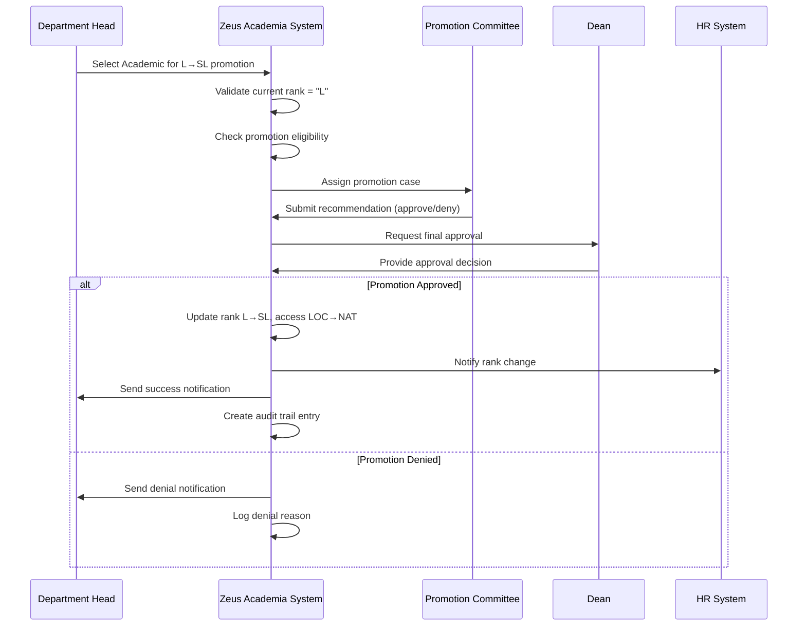

# Use Case: Promote Lecturer to Senior Lecturer

- Primary Actor: Department Head
- Supporting Actors: Promotion Committee, HR Administrator, Academic Registry
- Stakeholders and Interests: Faculty member (career advancement), Institution (quality assurance), Accreditation bodies (standards compliance)

- Goal: Successfully promote a qualified Lecturer to Senior Lecturer rank with proper validation and approval process
- Scope: Zeus Academia Academic Management System
- Level: User-goal

- Preconditions:
  1. Academic exists in system with current rank of Lecturer (L)
  2. Academic meets institutional requirements for Senior Lecturer promotion
  3. Department Head has authority to initiate promotions
  4. Promotion Committee is established and available

- Triggers:
  - Department Head initiates promotion request for eligible Lecturer

## Main Success Scenario
1. Department Head selects Academic with Lecturer rank for promotion review.
2. System validates Academic's current rank is "L" and promotion eligibility criteria.
3. System creates promotion case and assigns to appropriate Promotion Committee.
4. Promotion Committee reviews Academic's qualifications, teaching performance, and research output.
5. Committee submits recommendation (approve/deny) with detailed justification.
6. System notifies Department Head and Dean of committee recommendation.
7. Dean reviews and provides final approval decision.
8. System updates Academic's rank from "L" to "SL" and access level from "LOC" to "NAT".
9. System generates notifications to Academic, HR, Payroll, and Directory systems.
10. System creates audit trail entry documenting the promotion decision and effective date.

## Alternate/Exception Flows
A1. Academic does not meet promotion criteria (Step 2):
   1. System displays eligibility violations and available requirements.
   2. Department Head may address deficiencies or cancel promotion request.
   3. Use case ends.

A2. Committee recommends denial (Step 5):
   1. System records denial reason and notifies stakeholders.
   2. Academic may appeal decision through institutional grievance process.
   3. Use case ends with rank unchanged.

A3. Dean denies final approval (Step 7):
   1. System records administrative denial and rationale.
   2. Notifications sent to all parties including appeal process information.
   3. Use case ends with rank unchanged.

A4. System integration failure during rank update (Step 8):
   1. System rolls back any partial changes and logs error.
   2. IT Administrator is notified for manual intervention.
   3. Promotion remains in pending status until resolved.

## Postconditions
- Success Guarantees:
  - Academic's rank updated from "L" to "SL"
  - Access level automatically updated from "LOC" to "NAT"
  - All integrated systems (HR, Payroll, Directory) reflect new rank
  - Complete audit trail exists for the promotion decision
  - Stakeholder notifications sent successfully
- Minimal Guarantees:
  - No partial updates to Academic record
  - Promotion request status accurately reflects current state
  - System integrity maintained even if process fails

## Business Rules
- BR-001: Only Lecturers (L) may be promoted to Senior Lecturer (SL)
- BR-002: Senior Lecturer rank automatically grants National (NAT) access level
- BR-003: Promotion requires committee recommendation and administrative approval
- BR-004: All rank changes must maintain complete audit trail
- BR-005: Failed promotions do not affect Academic's current status
- BR-006: Promotion effective date cannot be retroactive beyond current academic year

## Non-Functional Notes
- Performance: Promotion processing should complete within 2 business days
- Security: Only authorized personnel can initiate and approve promotions
- Compliance: Process must meet accreditation standards and institutional policies
- Integration: Real-time updates to all dependent systems required
- Availability: System must handle concurrent promotion processes

