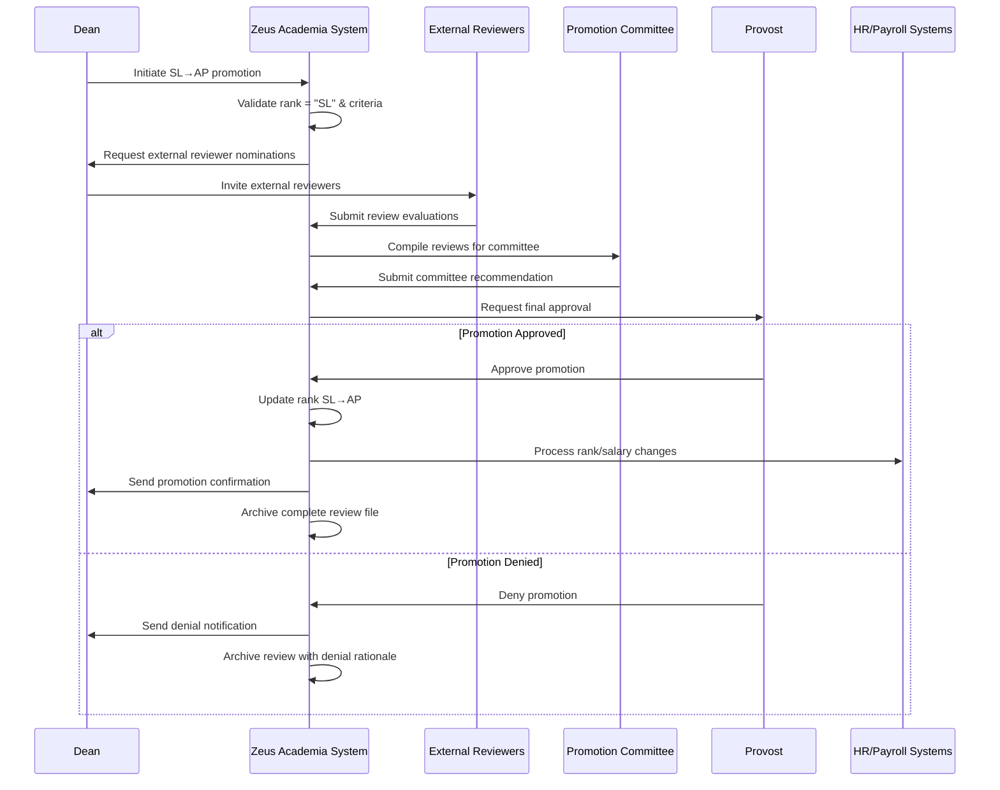

# Use Case: Promote Senior Lecturer to Associate Professor

- Primary Actor: Dean
- Supporting Actors: Promotion Committee, External Reviewers, Provost, HR Administrator
- Stakeholders and Interests: Faculty member (career advancement), Institution (academic excellence), External academic community (peer review standards)

- Goal: Successfully promote a qualified Senior Lecturer to Associate Professor rank through rigorous review process
- Scope: Zeus Academia Academic Management System
- Level: User-goal

- Preconditions:
  1. Academic exists in system with current rank of Senior Lecturer (SL)
  2. Academic meets institutional requirements for Associate Professor promotion
  3. Dean has authority to initiate senior-level promotions
  4. External review panel can be established
  5. Sufficient budget exists for external reviewer fees

- Triggers:
  - Dean initiates promotion request for eligible Senior Lecturer
  - Academic submits self-nomination for promotion consideration

## Main Success Scenario
1. Dean selects Academic with Senior Lecturer rank for Associate Professor promotion review.
2. System validates Academic's current rank is "SL" and comprehensive promotion criteria.
3. System creates senior promotion case requiring external review process.
4. Dean identifies and invites external reviewers from peer institutions.
5. System manages external review process including document sharing and timeline tracking.
6. External reviewers submit detailed evaluations and recommendations.
7. Internal Promotion Committee reviews external recommendations and Academic's complete dossier.
8. Committee submits comprehensive recommendation to Provost with external review summary.
9. Provost conducts final review considering institutional strategic needs.
10. System updates Academic's rank from "SL" to "AP" maintaining National (NAT) access level.
11. System coordinates notifications and integrates changes across all university systems.
12. System generates formal promotion letter and updates personnel records.

## Alternate/Exception Flows
A1. Academic does not meet comprehensive promotion criteria (Step 2):
   1. System displays detailed eligibility analysis and requirements gap.
   2. Dean may defer promotion or provide development recommendations.
   3. Use case ends with guidance for future consideration.

A2. External reviewers decline or are unavailable (Step 4-5):
   1. System tracks reviewer responses and availability.
   2. Dean expands reviewer pool and sends additional invitations.
   3. Process continues when sufficient external reviewers confirmed.

A3. External reviews are predominantly negative (Step 6):
   1. System compiles reviewer feedback for committee consideration.
   2. Committee may recommend denial or request additional evidence.
   3. Academic may withdraw application or proceed with negative reviews.

A4. Provost requires additional information (Step 9):
   1. System tracks additional requirements and extends timeline.
   2. Academic and committee provide supplementary materials.
   3. Review process continues with enhanced documentation.

A5. Budget constraints prevent external review process (Step 4):
   1. System flags budget limitation and notifies Dean.
   2. Promotion deferred to next budget cycle or alternative funding sought.
   3. Use case ends with scheduling for future consideration.

## Postconditions
- Success Guarantees:
  - Academic's rank updated from "SL" to "AP"
  - Access level remains "NAT" (no change required)
  - External review documentation archived in personnel file
  - All integrated systems reflect new Associate Professor status
  - Promotion effective date recorded with proper academic year alignment
  - Salary adjustment processed according to institutional scales
- Minimal Guarantees:
  - External reviewer feedback preserved regardless of outcome
  - Complete documentation of promotion process maintained
  - Academic's current status unchanged if promotion denied

## Business Rules
- BR-007: Only Senior Lecturers (SL) may be promoted to Associate Professor (AP)
- BR-008: Associate Professor promotion requires external peer review
- BR-009: Minimum 3 external reviewers required for valid promotion process
- BR-010: External reviewers must be from different institutions
- BR-011: Provost approval required for all Associate Professor promotions
- BR-012: Promotion timeline cannot exceed one academic year
- BR-013: Associate Professor rank maintains National (NAT) access level

## Non-Functional Notes
- Performance: External review process managed within 6-month timeline
- Security: Confidential reviewer identities protected throughout process
- Compliance: Process meets tenure-track requirements and accreditation standards
- Cost: External reviewer fees managed within departmental promotion budget
- Quality: Maintains institutional standards for associate-level appointments
- Documentation: Complete audit trail for tenure and promotion decisions

