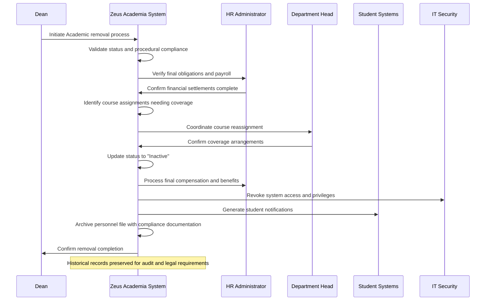

# Use Case: Remove Academic from Faculty

- Primary Actor: Dean
- Supporting Actors: Provost, HR Administrator, Legal Counsel, Department Head
- Stakeholders and Interests: Institution (resource management), Faculty body (job security), Students (academic continuity), Legal compliance (employment law)

- Goal: Properly remove an Academic from faculty status following all legal and procedural requirements
- Scope: Zeus Academia Academic Management System
- Level: User-goal

- Preconditions:
  1. Academic exists in system with current faculty status
  2. Legal grounds for termination have been established and documented
  3. All required procedural steps have been completed per employment policies
  4. Provost approval obtained for faculty termination
  5. Course reassignment planning completed to ensure academic continuity

- Triggers:
  - Employment termination decision finalized following disciplinary process
  - Resignation accepted and effective date established
  - Retirement process completed with official retirement date
  - Contract non-renewal decision becomes effective

## Main Success Scenario
1. Dean initiates Academic removal process with documented justification and legal approval.
2. System validates Academic's current status and reviews procedural compliance requirements.
3. System ensures all employment obligations have been satisfied (notice periods, due process).
4. HR Administrator verifies final payroll, benefits, and administrative obligations.
5. System identifies all current course assignments requiring immediate reassignment.
6. Department Head coordinates course coverage and student notification process.
7. System updates Academic status to "Inactive" and removes active faculty privileges.
8. System processes final compensation including unused leave and benefit terminations.
9. System revokes system access while preserving historical records for audit purposes.
10. System generates required notifications to students, colleagues, and external parties.
11. System archives complete personnel file and maintains compliance documentation.

## Alternate/Exception Flows
A1. Procedural requirements not satisfied (Step 3):
   1. System identifies missing procedural steps or documentation gaps.
   2. Dean must complete required procedures before proceeding with removal.
   3. Legal Counsel may advise on additional requirements or timeline adjustments.

A2. Outstanding financial or administrative obligations (Step 4):
   1. HR Administrator identifies unresolved obligations requiring settlement.
   2. Removal process suspended until obligations resolved or payment arrangements made.
   3. Financial holds may prevent final processing until resolution.

A3. Course assignments cannot be immediately covered (Step 5-6):
   1. System identifies critical courses without alternative instructor coverage.
   2. Academic's departure may be delayed to complete current term obligations.
   3. Emergency teaching arrangements or course cancellations may be required.

A4. Legal challenge filed against termination (Step 7):
   1. System maintains Academic status pending legal resolution.
   2. Access restrictions implemented while preserving employment relationship.
   3. Final removal deferred until legal proceedings conclude.

A5. Student complaints about course disruption (Step 10):
   1. System tracks student concerns and academic impact assessments.
   2. Academic Affairs may provide grade adjustments or course completion alternatives.
   3. Student support services engaged for academic continuity planning.

## Postconditions
- Success Guarantees:
  - Academic removed from active faculty status with proper effective date
  - All course assignments transferred to qualified replacement instructors
  - Final compensation and benefits processed according to policy
  - System access revoked while maintaining historical record integrity
  - Legal and procedural compliance fully documented
  - Student academic continuity preserved through proper course coverage
- Minimal Guarantees:
  - Academic's personnel record preserved for legal and audit requirements
  - Financial obligations settled according to employment contract terms
  - Institutional liability minimized through proper procedural adherence

## Business Rules
- BR-049: Academic removal requires Provost approval for all faculty terminations
- BR-050: All current course assignments must have coverage plans before removal
- BR-051: Final payroll must include all earned compensation and benefit obligations
- BR-052: System access revoked immediately upon effective termination date
- BR-053: Personnel records maintained permanently for legal compliance
- BR-054: Student notification required for all mid-semester instructor changes
- BR-055: Exit procedures must comply with employment law and institutional policy

## Non-Functional Notes
- Legal: Complete compliance with employment law and due process requirements
- Security: Immediate access revocation while preserving record integrity
- Continuity: Academic program continuity maintained through proper transition planning
- Compliance: Full documentation for potential legal review and audit requirements
- Support: Student support services engaged for academic impact mitigation
- Archive: Permanent record retention for historical and legal reference

