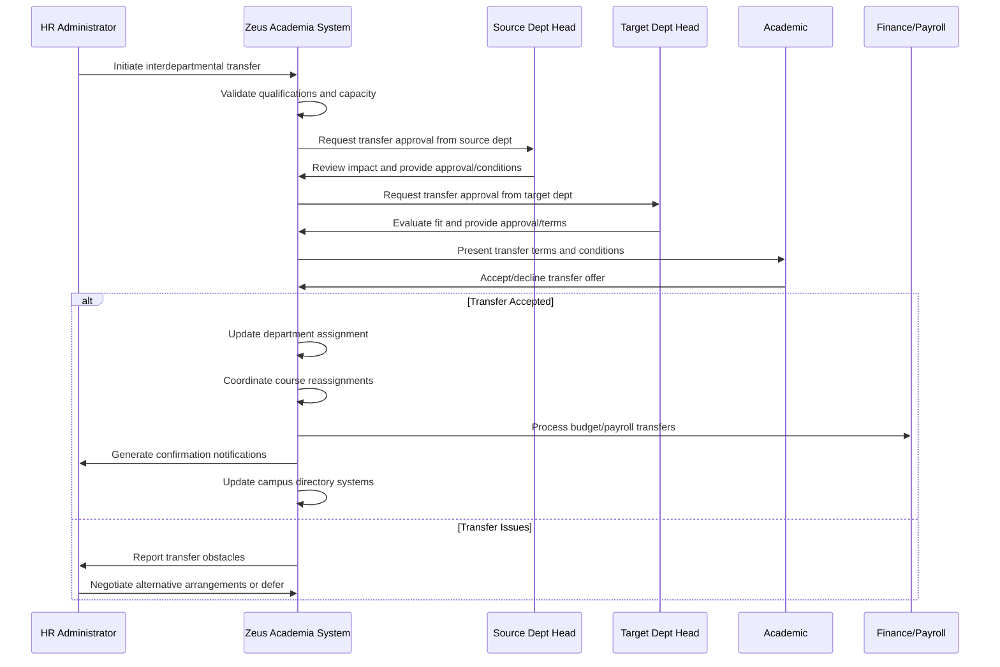

# Use Case: Transfer Academic Between Departments

- Primary Actor: HR Administrator
- Supporting Actors: Source Department Head, Target Department Head, Academic, Provost
- Stakeholders and Interests: Academic (career opportunity), Departments (resource allocation), Students (course continuity), Institution (faculty optimization)

- Goal: Successfully transfer an Academic from one department to another with proper validation and administrative processing
- Scope: Zeus Academia Academic Management System
- Level: User-goal

- Preconditions:
  1. Academic exists with current department assignment and valid employment status
  2. Target department has position availability and budgetary capacity
  3. Academic meets qualifications for target department role requirements
  4. Both Department Heads are informed and available for approval process
  5. Current academic term allows for mid-cycle transfers if applicable

- Triggers:
  - Academic requests interdepartmental transfer for career development
  - Target department recruits Academic for specific role or expertise need
  - Institutional reorganization requires faculty redistribution
  - Source department has budget constraints requiring faculty reallocation

## Main Success Scenario
1. HR Administrator initiates transfer process following Academic's request or departmental need.
2. System validates Academic's qualifications against target department requirements.
3. System checks target department capacity including budget allocation and position availability.
4. Source Department Head reviews transfer impact on current courses and commitments.
5. Target Department Head evaluates Academic's fit with departmental needs and culture.
6. System generates transfer proposal including effective date and transitional arrangements.
7. Both Department Heads formally approve transfer with agreed-upon conditions.
8. Academic accepts transfer terms including new responsibilities and reporting structure.
9. System updates department assignment and transfers all relevant administrative records.
10. System coordinates course reassignments and student notifications as required.
11. System processes payroll, benefits, and budget adjustments between departments.
12. System generates confirmation notifications and updates campus directory systems.

## Alternate/Exception Flows
A1. Academic does not meet target department qualifications (Step 2):
   1. System identifies specific qualification gaps and requirements not met.
   2. Target Department Head may waive requirements or provide development plan.
   3. Transfer may be conditional upon completing additional qualifications.

A2. Target department lacks budget or position capacity (Step 3):
   1. System displays budget constraints and position availability limitations.
   2. HR Administrator may seek budget reallocation or defer transfer to next budget cycle.
   3. Provost approval may be required for budget adjustments between departments.

A3. Source Department Head objects to transfer (Step 4):
   1. System records objection reasons and impact assessment on source department.
   2. HR Administrator mediates between departments to resolve staffing concerns.
   3. Transfer timeline may be adjusted to allow for replacement hiring.

A4. Academic declines final transfer terms (Step 8):
   1. System maintains current department assignment and cancels transfer process.
   2. Alternative arrangements may be negotiated to address Academic's concerns.
   3. Transfer opportunity may be deferred pending resolution of issues.

A5. Course coverage problems prevent immediate transfer (Step 10):
   1. System identifies courses requiring coverage before Academic can transfer.
   2. Transfer effective date adjusted to complete current term obligations.
   3. Temporary teaching arrangements may be required during transition period.

## Postconditions
- Success Guarantees:
  - Academic successfully reassigned to target department with updated records
  - All course assignments properly transferred or covered by qualified replacements
  - Budget allocations adjusted between departments reflecting faculty transfer
  - Campus directory and all systems updated with new department assignment
  - Payroll and benefits administration transferred to target department
  - Student notifications completed for any affected courses or advisement
- Minimal Guarantees:
  - Academic's employment status and benefits preserved throughout process
  - Course continuity maintained for affected students
  - Departmental budgets remain balanced following any adjustments

## Business Rules
- BR-056: Academic must meet target department's minimum qualification requirements
- BR-057: Both source and target Department Heads must approve interdepartmental transfers
- BR-058: Budget capacity must exist in target department for faculty transfer
- BR-059: Current course obligations must be resolved before transfer completion
- BR-060: Payroll and benefits administration transfers with Academic's department assignment
- BR-061: Transfer effective date cannot disrupt mid-semester course continuity
- BR-062: Campus directory updates required within 24 hours of transfer approval

## Non-Functional Notes
- Performance: Transfer processing should complete within 10 business days
- Integration: Seamless updates across HR, payroll, directory, and academic systems
- Flexibility: Support for conditional transfers and phased transition arrangements
- Compliance: Maintain employment law compliance throughout transfer process
- Communication: Clear notification to all affected parties including students
- Audit: Complete documentation of transfer rationale and approval process

