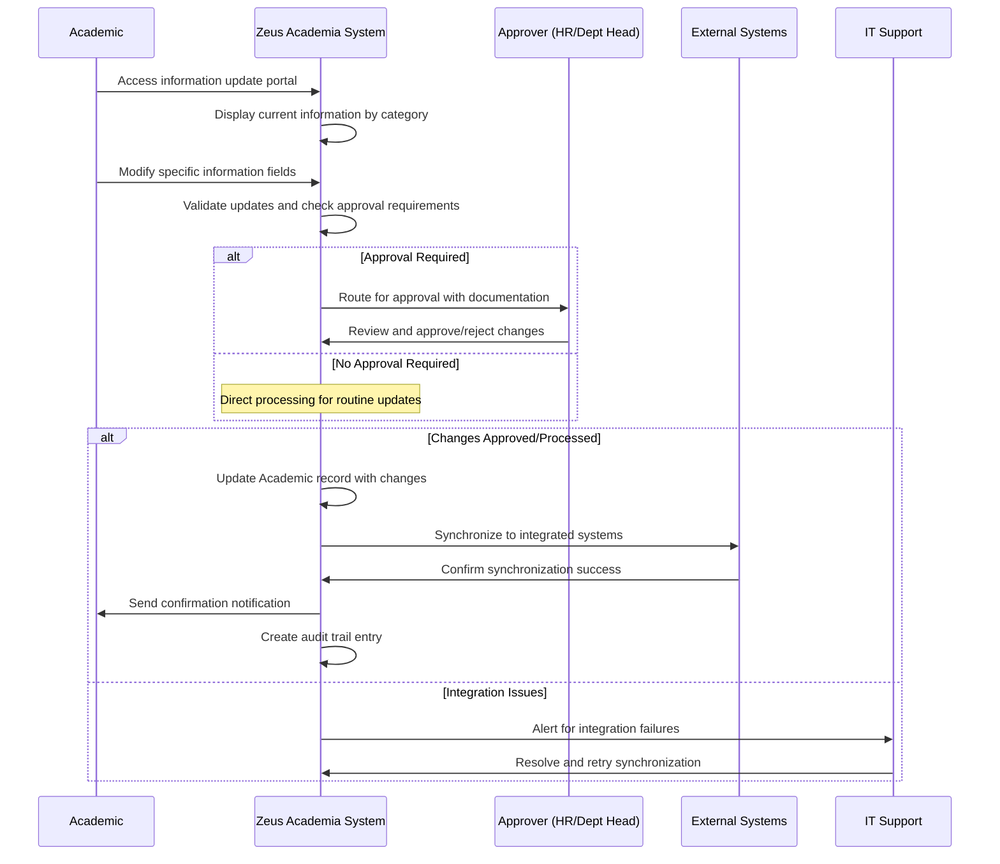

# Use Case: Update Academic Personal or Professional Information

- Primary Actor: Academic
- Supporting Actors: HR Administrator, Department Head, IT Support
- Stakeholders and Interests: Academic (accurate records), HR (compliance), Institution (current information), External systems (data synchronization)

- Goal: Update an Academic's personal or professional information with proper validation and system synchronization
- Scope: Zeus Academia Academic Management System
- Level: User-goal

- Preconditions:
  1. Academic has valid system access and authentication credentials
  2. Academic's employment status is active in the system
  3. Information update categories and validation rules are defined
  4. Integration endpoints for external systems are functional
  5. Data privacy and security policies are established and accessible

- Triggers:
  - Academic initiates self-service information update through system portal
  - HR Administrator updates information following official documentation
  - Department Head requests information correction following notification
  - External system integration identifies data synchronization discrepancies

## Main Success Scenario
1. Academic accesses personal information management interface through secure portal.
2. System displays current information organized by categories (personal, contact, professional, emergency).
3. Academic selects information category to update and modifies specific fields.
4. System validates updated information for format, completeness, and business rule compliance.
5. System determines approval requirements based on information type and change impact.
6. Academic submits changes with any required supporting documentation.
7. System routes updates requiring approval to appropriate authority (HR, Department Head).
8. Approver reviews changes and supporting documentation for accuracy and legitimacy.
9. System updates Academic record with approved changes and timestamps modifications.
10. System synchronizes updates to integrated systems (directory, payroll, benefits, email).
11. System generates confirmation notification to Academic with change summary.
12. System maintains audit trail of all changes for compliance and historical reference.

## Alternate/Exception Flows
A1. Information validation fails (Step 4):
   1. System displays specific validation errors and format requirements.
   2. Academic corrects validation issues and resubmits information.
   3. Process continues once all validation requirements are satisfied.

A2. Supporting documentation required but not provided (Step 6):
   1. System identifies missing documentation requirements and provides guidance.
   2. Academic uploads required documents or provides explanation for exemption.
   3. Submission blocked until documentation requirements satisfied.

A3. Approver requests additional verification (Step 8):
   1. System tracks verification request and extends approval timeline.
   2. Academic provides additional documentation or clarification as requested.
   3. Approval process continues with enhanced verification completed.

A4. External system integration fails (Step 10):
   1. System logs integration errors and maintains local changes.
   2. IT Support notified for integration troubleshooting and resolution.
   3. Manual synchronization may be required until automatic integration restored.

A5. Changes affect multiple linked records (Step 9):
   1. System identifies related records requiring corresponding updates.
   2. Cascading changes applied automatically where appropriate.
   3. Manual review required for complex relationships affecting multiple systems.

## Postconditions
- Success Guarantees:
  - Academic's information updated accurately in primary system
  - All required approvals obtained and documented
  - Changes synchronized to all integrated external systems
  - Audit trail complete with change details, approvals, and timestamps
  - Academic notified of successful updates with confirmation details
  - Data privacy and security maintained throughout update process
- Minimal Guarantees:
  - Original information preserved if updates fail or are rejected
  - System integrity maintained with rollback capability if needed
  - Compliance requirements satisfied for all information changes

## Business Rules
- BR-063: Personal contact information updates do not require approval
- BR-064: Professional information changes require Department Head approval
- BR-065: Emergency contact updates are processed immediately for safety
- BR-066: Degree and credential changes require official documentation
- BR-067: Name changes require legal documentation and HR approval
- BR-068: Address changes automatically update tax and payroll systems
- BR-069: All changes maintain complete audit trail for compliance

## Non-Functional Notes
- Security: All information updates protected by authentication and authorization
- Performance: Updates processed within 24 hours for non-approval required changes
- Integration: Real-time synchronization with critical systems (directory, email)
- Usability: Intuitive interface with clear validation messages and help guidance
- Availability: Self-service portal available 24/7 with maintenance windows
- Privacy: Information access restricted based on role and need-to-know principles

