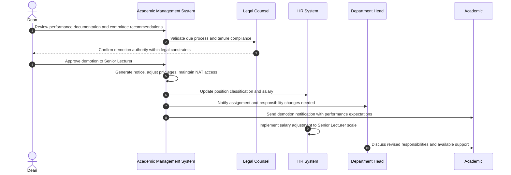

# Use Case: Demote Associate Professor to Senior Lecturer

- Primary Actor: Dean
- Supporting Actors: HR Administrator, Department Head, Legal Counsel, Faculty Review Committee
- Stakeholders and Interests: Academic (career protection), Department (performance standards), University (quality assurance)

- Goal: Appropriately demote an Associate Professor to Senior Lecturer following documented performance deficiencies and required institutional due process.
- Scope: Academic Management System
- Level: User-goal

- Preconditions:

  1. Academic currently holds Associate Professor position
  2. Documented performance deficiencies in teaching, research, or service over sustained period
  3. Performance improvement plan attempted without sufficient progress
  4. Faculty Review Committee completed formal evaluation process
  5. Legal compliance with tenure protections and employment contract verified

- Triggers:
  - Dean receives Faculty Review Committee recommendation for demotion due to performance issues

## Main Success Scenario

1. Dean reviews comprehensive performance documentation, improvement plan results, and committee recommendations.
2. System validates completion of all required due process steps and performance evaluation procedures.
3. Dean consults with Legal Counsel to ensure compliance with tenure provisions and employment contracts.
4. Dean formally approves demotion from Associate Professor to Senior Lecturer with documented rationale.
5. System generates official demotion notice detailing performance issues and expectations for new role.
6. HR Administrator updates position classification, salary schedule, and benefit adjustments.
7. System removes Associate Professor research privileges and sabbatical entitlements as appropriate.
8. System maintains Academic's access level at 'NAT' (National) as Senior Lecturer retains same access.
9. Department Head receives notification to adjust Academic's course assignments and committee responsibilities.
10. Academic receives formal demotion notification with performance expectations and support resources available.
11. System implements salary adjustment to Senior Lecturer pay scale with appropriate transition timeline.
12. Academic's teaching load and service assignments modified to reflect Senior Lecturer position requirements.

## Alternate/Exception Flows

A1. Tenure protections prevent demotion:

1.  At step 3, Legal Counsel determines tenure provisions prohibit rank demotion.
2.  Alternative performance remediation measures explored (modified duties, additional support, etc.).
3.  Demotion cancelled in favor of alternative disciplinary or support measures. End.

A2. Performance evaluation appeal pending:

1.  At step 2, Academic has active appeal of performance evaluation in progress.
2.  Demotion action suspended until appeal process completed per institutional policy.
3.  Demotion proceeds or cancelled based on appeal outcome. Rejoin at step 4 or End.

A3. Academic requests voluntary resignation:

1.  After step 5, Academic chooses resignation over accepting demotion to Senior Lecturer.
2.  System initiates standard resignation process instead of continuing demotion.
3.  Resignation procedures replace demotion workflow entirely. End.

A4. Department Head contests demotion decision:

1.  At step 9, Department Head argues Academic's contributions warrant retention at Associate Professor level.
2.  Dean reviews additional departmental input and may modify decision.
3.  Final decision communicated to all stakeholders. Continue at step 10 or End if reversed.

## Postconditions

- Success Guarantees:
  - Academic's position changed to Senior Lecturer with appropriate compensation
  - Research privileges and sabbatical eligibility adjusted to Senior Lecturer level
  - Teaching and service assignments reflect Senior Lecturer expectations and workload
  - Performance improvement expectations clearly established with available support resources
- Minimal Guarantees:
  - All required due process procedures documented as completed
  - Employment continues with protections appropriate to Senior Lecturer position
  - Complete record maintained for future performance reviews and potential appeals

## Business Rules

- Performance deficiencies must be documented over minimum 2-year evaluation period
- Academic must receive formal performance improvement plan with clear metrics and timeline
- Salary reduction limited to difference between Associate Professor and Senior Lecturer scales
- Research support adjusted according to Senior Lecturer institutional policies
- Opportunity for performance recovery and potential future re-promotion must remain available

## Non-Functional Notes

- Performance documentation must meet legal and institutional standards for employment actions
- Sensitive personnel decisions require confidential handling and secure access
- System must track performance metrics and improvement plan compliance over time
- Integration with payroll ensures smooth salary transition without payment interruption

## Open Issues

- Define specific measurable performance metrics triggering demotion consideration
- Clarify research privilege restoration timeline if performance substantially improves
- Determine eligibility criteria and timeline for potential future re-promotion consideration

## Diagram

