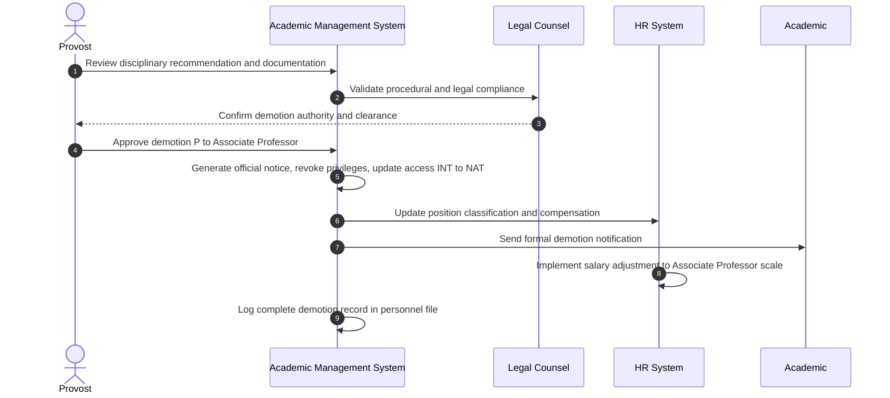

# Use Case: Demote Professor to Associate Professor

- Primary Actor: Provost
- Supporting Actors: HR Administrator, Legal Counsel, University Review Committee, Dean
- Stakeholders and Interests: Academic (due process rights), University (academic standards), Faculty (procedural fairness)

- Goal: Lawfully demote a Professor to Associate Professor following appropriate due process, documentation, and institutional procedures.
- Scope: Academic Management System
- Level: User-goal

- Preconditions:

  1. Academic currently holds Professor rank ('P')
  2. Documented serious performance deficiencies or misconduct warranting demotion
  3. Formal disciplinary process completed with demotion recommendation
  4. Legal review confirms compliance with employment contracts and institutional policies
  5. All appeals processes exhausted or waived

- Triggers:
  - Provost receives final disciplinary committee recommendation for demotion action

## Main Success Scenario

1. Provost reviews comprehensive disciplinary file and legal clearance documentation.
2. System validates all required due process steps and procedural compliance completed.
3. Provost consults with Legal Counsel to confirm demotion authority and process adherence.
4. Provost formally approves demotion from Professor to Associate Professor with effective date.
5. System generates official demotion notice with detailed rationale and supporting documentation.
6. HR Administrator updates Academic's position classification and compensation structure.
7. System revokes Professor-level privileges (enhanced research accounts, administrative eligibility, sabbatical priority).
8. System adjusts Academic's access level from 'INT' to 'NAT' reflecting new Associate Professor status.
9. Department Head receives notification to update local assignments and committee memberships.
10. Academic receives formal demotion notification with revised employment terms and appeal rights information.
11. System logs demotion action in Academic's permanent personnel record with complete documentation.
12. Payroll system implements salary adjustment according to Associate Professor scale from effective date.

## Alternate/Exception Flows

A1. Legal compliance deficiency identified:

1.  At step 2, system or Legal Counsel identifies procedural gap or due process violation.
2.  Demotion action suspended pending resolution of compliance issues.
3.  Additional procedural steps completed or demotion cancelled. End or rejoin at step 1.

A2. Academic files emergency legal challenge:

1.  After step 5, Academic seeks court injunction or files grievance to halt demotion.
2.  All system updates placed on administrative hold pending legal resolution.
3.  Demotion proceeds only after legal clearance received. Rejoin at step 6 or End.

A3. Union or faculty grievance filed:

1.  After step 10, faculty union or Academic files formal grievance challenging demotion.
2.  Grievance process must complete before final implementation.
3.  Demotion upheld, modified, or reversed based on grievance outcome.

A4. Academic resigns during process:

1.  Between steps 1-10, Academic submits resignation letter to avoid demotion.
2.  System processes resignation instead of continuing demotion workflow.
3.  Standard resignation procedures replace demotion process. End.

## Postconditions

- Success Guarantees:
  - Academic's rank reduced to Associate Professor with appropriate compensation adjustment
  - Access level changed from International to National
  - Enhanced Professor privileges removed while maintaining Associate Professor rights
  - Complete legal and procedural documentation maintained
- Minimal Guarantees:
  - No status changes until all legal requirements satisfied
  - Complete audit trail preserved for potential legal proceedings
  - Academic retains basic employment protections during entire process

## Business Rules

- Demotion requires completion of formal disciplinary process with faculty committee involvement
- Academic must receive minimum 30-day written notice before demotion effective date
- Salary reduction limited by employment contract terms (typically maximum 10-15% annually)
- Tenure status may be retained unless separately revoked through distinct process
- Appeal rights must be clearly communicated and remain available post-demotion

## Non-Functional Notes

- All demotion actions require comprehensive legal review and documentation
- Sensitive personnel information must be secured with appropriate access controls
- System must maintain detailed audit logs for potential legal proceedings
- Integration with payroll systems ensures accurate compensation adjustments

## Open Issues

- Define specific Professor privileges revoked versus retained after demotion
- Clarify interaction between demotion and existing sabbatical leave entitlements
- Determine criteria and procedures for potential future reinstatement to Professor rank

## Diagram

