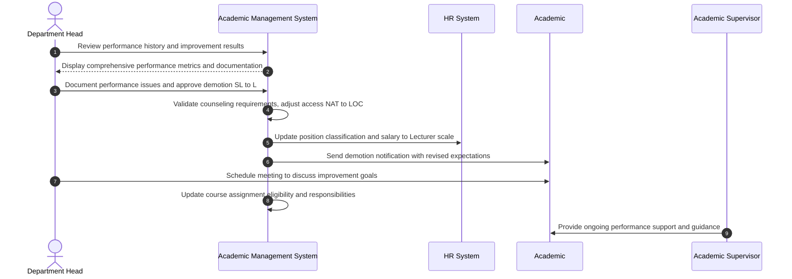

# Use Case: Demote Senior Lecturer to Lecturer

- Primary Actor: Department Head
- Supporting Actors: HR Administrator, Academic Supervisor, Dean (if required)
- Stakeholders and Interests: Academic (employment security), Department (performance standards), Students (teaching quality)

- Goal: Appropriately demote a Senior Lecturer to Lecturer position due to documented performance issues while maintaining fair employment practices and due process.
- Scope: Academic Management System
- Level: User-goal

- Preconditions:

  1. Academic currently holds Senior Lecturer position (Rank 'SL')
  2. Documented performance deficiencies in teaching, service, or professional development
  3. Performance counseling and improvement plan attempted without sufficient progress
  4. Department Head has authority for lecturer-level employment decisions
  5. HR policies for demotion procedures have been followed

- Triggers:
  - Department Head initiates demotion action following unsuccessful performance improvement period

## Main Success Scenario

1. Department Head reviews Academic's performance history, improvement plan results, and documented deficiencies.
2. System displays comprehensive performance metrics, student evaluations, supervisor assessments, and improvement timeline.
3. Department Head documents specific performance issues justifying demotion with supporting evidence.
4. System validates that required performance counseling sessions and improvement opportunities were provided.
5. Department Head approves demotion from Senior Lecturer to Lecturer with performance rationale.
6. System generates demotion notice outlining performance concerns and expectations for Lecturer role.
7. HR Administrator updates position classification and implements salary adjustment to Lecturer scale.
8. System removes Senior Lecturer privileges (advanced course assignments, mentoring responsibilities, committee leadership).
9. System adjusts Academic's access level from 'NAT' to 'LOC' reflecting Lecturer position.
10. Academic receives formal notification with revised job responsibilities and performance expectations.
11. Department Head schedules meeting with Academic to discuss performance improvement goals and available support.
12. System updates course assignment eligibility to reflect Lecturer-level responsibilities and qualifications.

## Alternate/Exception Flows

A1. Insufficient performance documentation:

1.  At step 4, system identifies gaps in required performance counseling records or improvement plan documentation.
2.  Department Head must complete additional documentation and counseling sessions before proceeding.
3.  Demotion postponed until proper performance management procedures followed. Rejoin at step 1.

A2. Academic disputes performance evaluation accuracy:

1.  After step 6, Academic formally challenges performance assessment or evaluation methodology.
2.  Department Head reviews disputed items and may request third-party evaluation or Dean involvement.
3.  Demotion proceeds, modified, or cancelled based on dispute resolution outcome.

A3. HR policy compliance issue identified:

1.  At step 7, HR Administrator identifies procedural non-compliance with institutional demotion policies.
2.  Demotion action suspended pending policy compliance review and correction.
3.  Additional procedural steps completed or alternative actions considered.

A4. Academic accepts voluntary performance remediation:

1.  At step 10, Academic requests additional improvement opportunity instead of accepting demotion.
2.  Department Head may offer final comprehensive performance improvement plan with strict timeline.
3.  Demotion deferred pending remediation results. End or rejoin based on improvement outcome.

## Postconditions

- Success Guarantees:
  - Academic's position adjusted to Lecturer with appropriate responsibilities and compensation
  - Access level changed from National ('NAT') to Local ('LOC')
  - Course assignments and service responsibilities align with Lecturer position requirements
  - Clear performance expectations established for continued successful employment
- Minimal Guarantees:
  - Employment continues at appropriate level with fair compensation and working conditions
  - All required procedural documentation completed and maintained for personnel records
  - Opportunity for performance improvement and professional development support continues

## Business Rules

- Performance issues must be documented over minimum 1-year period with formal counseling sessions
- Academic must receive written performance improvement plan with measurable goals and timeline
- Salary adjustment limited to difference between Senior Lecturer and Lecturer pay scales
- Course load complexity and advanced assignments adjusted to match Lecturer position expectations
- Professional development support continues at level appropriate for Lecturer role and career growth

## Non-Functional Notes

- Performance counseling records must be maintained confidentially with appropriate access controls
- Demotion processing should complete within 30 calendar days of final decision
- Student course assignments managed to minimize disruption to ongoing academic programs
- System must maintain complete audit trail of all performance-related decisions and communications

## Open Issues

- Define specific performance improvement timeline requirements and measurement criteria
- Clarify course reassignment procedures during active academic term
- Determine eligibility criteria and timeline for future promotion reconsideration

## Diagram

