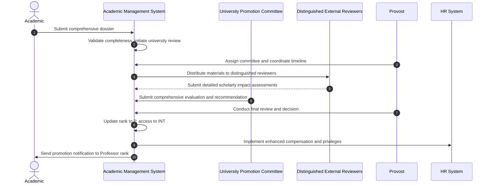

# Use Case: Promote Associate Professor to Professor

- Primary Actor: Provost
- Supporting Actors: University Promotion Committee, Distinguished External Reviewers, Dean, HR Administrator
- Stakeholders and Interests: Academic (career pinnacle), University (academic prestige), Academic Community (scholarly standards)

- Goal: Successfully promote an exceptional Associate Professor to full Professor rank through the most rigorous institutional review process.
- Scope: Academic Management System
- Level: User-goal

- Preconditions:

  1. Academic currently holds Associate Professor position with tenure
  2. Academic meets Professor eligibility criteria (national recognition, sustained excellence)
  3. University Promotion Committee constituted for senior-level promotions
  4. Distinguished external reviewers from top-tier institutions secured
  5. Provost has final promotion approval authority

- Triggers:
  - Associate Professor submits application for promotion to Professor during designated promotion cycle

## Main Success Scenario

1. Academic submits comprehensive promotion dossier including research impact evidence, teaching portfolio, and service record.
2. System validates dossier completeness and initiates university-level review process.
3. Provost assigns University Promotion Committee and coordinates review timeline.
4. System distributes materials to distinguished external reviewers at leading institutions.
5. External reviewers provide detailed assessments of Academic's scholarly impact and national/international recognition.
6. Department and College committees submit supporting recommendations and evaluations.
7. University Promotion Committee conducts comprehensive evaluation including deliberation meeting.
8. Committee submits formal recommendation to Provost with detailed justification.
9. Provost conducts final review of all materials and committee recommendation.
10. Provost approves promotion to Professor with enhanced research privileges and administrative eligibility.
11. System updates Academic's rank to 'P' and access level to 'INT' (International).
12. HR Administrator implements enhanced salary, sabbatical entitlements, and research support.
13. Academic receives formal notification of promotion to highest faculty rank with associated privileges.

## Alternate/Exception Flows

A1. Insufficient distinguished external participation:

1.  At step 4, required number of external reviewers not secured from target institutions.
2.  Promotion Committee extends timeline and approaches additional distinguished scholars.
3.  Review process adjusted with extended timeline. Rejoin at step 5.

A2. Mixed or negative external assessments:

1.  At step 5, external reviews reveal concerns about scholarly impact or recognition level.
2.  Committee conducts additional analysis and may seek supplementary expert opinions.
3.  Committee proceeds with comprehensive evaluation considering all evidence.

A3. University Committee recommends denial:

1.  At step 8, Committee determines evidence insufficient for Professor rank.
2.  System generates comprehensive feedback report with specific improvement areas.
3.  Academic receives detailed guidance for future promotion consideration. End.

A4. Provost requests additional information:

1.  At step 9, Provost identifies need for clarification or supplementary evidence.
2.  Committee provides additional documentation and analysis as requested.
3.  Provost completes evaluation with additional information. Rejoin at step 10.

## Postconditions

- Success Guarantees:
  - Academic achieves highest faculty rank of Professor ('P')
  - Access level updated to International ('INT')
  - Enhanced salary, research support, and sabbatical privileges activated
  - Eligibility for senior administrative roles and distinguished appointments
- Minimal Guarantees:
  - Complete documentation preserved for institutional records
  - Confidential review materials protected according to academic standards
  - Promotion decision rationale documented for transparency

## Business Rules

- Minimum 6 years in Associate Professor rank typically required
- National/international recognition evidenced through publications, citations, awards, leadership
- Sustained excellence in teaching and significant professional service required
- External reviewers must be full Professors from Research 1 institutions
- Access level automatically updated to International ('INT') upon promotion

## Non-Functional Notes

- Review process may extend across two academic semesters due to complexity
- Highest level confidentiality required for all materials and deliberations
- System must handle complex document management and reviewer coordination
- Integration with research administration systems for enhanced privileges

## Open Issues

- Define specific metrics for "national/international recognition" by academic discipline
- Clarify enhanced research privileges and administrative role eligibility
- Determine sabbatical scheduling priority policies post-promotion

## Diagram

