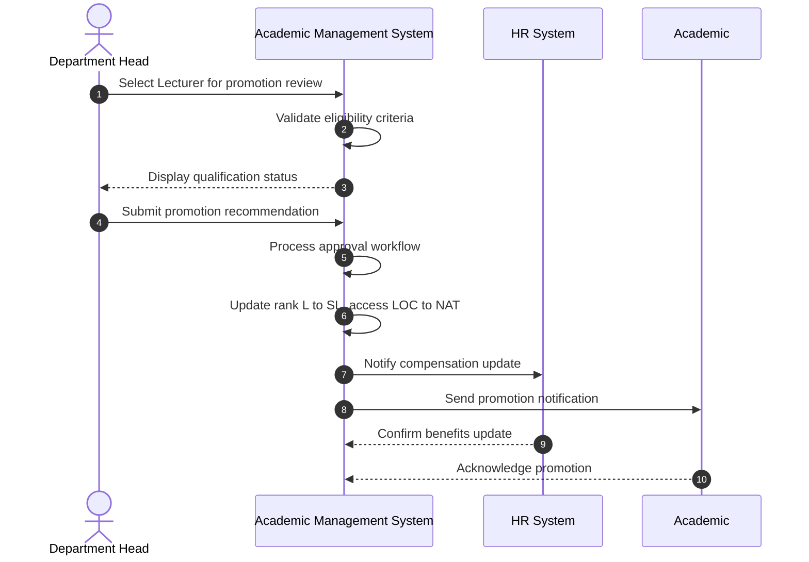

# Use Case: Promote Lecturer to Senior Lecturer

- Primary Actor: Department Head
- Supporting Actors: HR Administrator, Academic Registry, Promotion Committee
- Stakeholders and Interests: Academic (career advancement), University (staff development), Department (faculty quality)

- Goal: Successfully promote a qualified Lecturer to Senior Lecturer position following institutional criteria and approval processes.
- Scope: Academic Management System
- Level: User-goal

- Preconditions:

  1. Academic currently holds Lecturer position (Rank 'L')
  2. Academic meets minimum eligibility criteria (years in position, performance standards)
  3. Department Head has promotion approval authority
  4. Budget allocation exists for Senior Lecturer position

- Triggers:
  - Department Head initiates promotion review for eligible Lecturer during promotion cycle

## Main Success Scenario

1. Department Head accesses promotion interface and selects Lecturer for review.
2. System displays Academic's current profile, performance history, and promotion eligibility status.
3. Department Head reviews Academic's qualifications against Senior Lecturer criteria.
4. System validates that Academic meets minimum requirements (years in position, performance ratings, qualifications).
5. Department Head submits promotion recommendation with supporting documentation.
6. System routes recommendation through approval workflow (if required by institutional policy).
7. System updates Academic's rank from 'L' to 'SL' with effective date.
8. System adjusts Academic's access level from 'LOC' to 'NAT' automatically.
9. HR Administrator receives notification to update compensation and benefits.
10. System generates promotion notification and updates faculty directory.
11. Academic receives formal promotion confirmation with new responsibilities and privileges.

## Alternate/Exception Flows

A1. Academic does not meet eligibility criteria:

1.  At step 4, system identifies deficiencies (insufficient time in rank, performance issues).
2.  System displays specific requirements and timeline for eligibility.
3.  Department Head can defer promotion or create development plan. End.

A2. Budget constraints prevent promotion:

1.  At step 7, system detects insufficient budget allocation for promotion.
2.  System places promotion in pending status and notifies appropriate administrators.
3.  Promotion proceeds when budget becomes available or is cancelled. End.

A3. Academic declines promotion:

1.  After step 10, Academic formally declines promotion offer.
2.  System reverts promotion and maintains current Lecturer status.
3.  Declination is logged with reason for future reference. End.

## Postconditions

- Success Guarantees:
  - Academic's rank is updated to Senior Lecturer ('SL')
  - Access level automatically changed to National ('NAT')
  - Compensation and benefits reflect new position
  - All integrated systems updated with new status
- Minimal Guarantees:
  - No partial rank updates occur
  - Complete audit trail maintained
  - Original status preserved until promotion fully processed

## Business Rules

- Minimum 3 years in Lecturer position required for eligibility
- Performance evaluations must meet departmental standards
- Promotion effective date aligns with institutional policy
- Access level automatically maps to rank (Senior Lecturer = National access)

## Non-Functional Notes

- Promotion processing completes within 2 business days
- System maintains complete audit trail for compliance
- Integration with HR and payroll systems required
- Email notifications sent to all relevant stakeholders

## Open Issues

- Define specific performance criteria thresholds for eligibility
- Clarify budget approval process for cross-fiscal-year promotions

## Diagram

