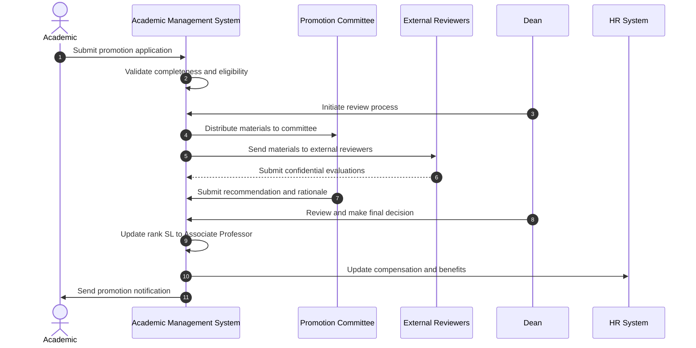

# Use Case: Promote Senior Lecturer to Associate Professor

- Primary Actor: Dean
- Supporting Actors: Promotion Committee, External Reviewers, HR Administrator, Provost
- Stakeholders and Interests: Academic (career advancement), Faculty (scholarly standards), University (academic excellence)

- Goal: Successfully promote a qualified Senior Lecturer to Associate Professor following rigorous peer review and institutional approval process.
- Scope: Academic Management System
- Level: User-goal

- Preconditions:

  1. Academic currently holds Senior Lecturer position (Rank 'SL')
  2. Academic meets Associate Professor eligibility criteria
  3. Promotion Committee established with appropriate expertise
  4. External reviewers identified and available
  5. Dean has promotion approval authority

- Triggers:
  - Academic submits application for promotion to Associate Professor during promotion cycle

## Main Success Scenario

1. Academic submits comprehensive promotion application through system interface.
2. System validates application completeness and eligibility requirements.
3. Dean initiates formal review process and assigns Promotion Committee.
4. System distributes application materials to Committee and external reviewers.
5. External reviewers submit confidential evaluations within specified timeframe.
6. Promotion Committee conducts comprehensive review and deliberation.
7. Committee submits recommendation (promote/deny) with detailed rationale.
8. Dean reviews committee recommendation and supporting documentation.
9. Dean approves promotion to Associate Professor with tenure consideration.
10. System updates Academic's rank and initiates tenure track status if applicable.
11. System adjusts access level and research privileges automatically.
12. HR Administrator updates compensation, sabbatical eligibility, and benefits.
13. Academic receives formal promotion notification with new responsibilities.

## Alternate/Exception Flows

A1. Application materials incomplete:

1.  At step 2, system identifies missing required documents or information.
2.  System notifies Academic of deficiencies with submission deadline.
3.  Academic resubmits complete application or withdraws. Rejoin at step 2 or End.

A2. External reviewer unavailable:

1.  At step 4, designated external reviewer declines or becomes unavailable.
2.  Committee Chair selects alternate reviewer from approved list.
3.  System sends materials to replacement reviewer. Rejoin at step 5.

A3. Committee recommends denial:

1.  At step 7, Promotion Committee votes against promotion.
2.  System generates detailed feedback report explaining decision.
3.  Academic receives notification with improvement recommendations. End.

A4. Dean overrides committee decision:

1.  At step 9, Dean disagrees with committee recommendation.
2.  Dean provides written justification for decision override.
3.  System escalates to Provost for final determination if required.

## Postconditions

- Success Guarantees:
  - Academic promoted to Associate Professor rank
  - Tenure track status activated (if institutional policy requires)
  - Access level and research privileges updated appropriately
  - Compensation and sabbatical eligibility reflect new position
- Minimal Guarantees:
  - All review materials preserved for appeals process
  - Confidentiality of external reviews maintained
  - Complete documentation of decision rationale

## Business Rules

- Minimum 5 years in Senior Lecturer position typically required
- Excellence in teaching, research, and service demonstrated
- External reviewers must be from peer or higher-ranked institutions
- Tenure consideration follows institutional tenure policy
- Access level remains 'NAT' for Associate Professor

## Non-Functional Notes

- Complete review process typically spans one academic semester
- Confidential materials require secure handling and access controls
- System must support document management for complex review materials
- Integration with tenure tracking systems if applicable

## Open Issues

- Define specific research output requirements by academic discipline
- Clarify tenure timeline and requirements correlation with promotion
- Determine appeal process procedures and timeline

## Diagram

